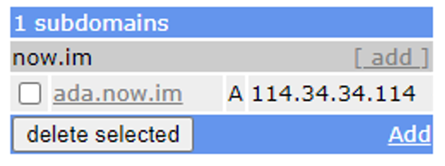

# <!--fit--> Cardano Pool Guide

建置 Cardano Stake Pool 正體中文手冊

https://oneleo.github.io/Cardano-Pool-Guide/

<!-- This is presenter note. You can write down notes through HTML comment. -->

---

---

## **前置作業**

1. 申請 [FreeDNS](https://freedns.afraid.org/) 免費子網域，這邊以 114.34.34.114 指到 ada.now.im 為例

2. 安裝 2 臺 RAM 至少有 12GB 的 Ubuntu LTS 主機

---

## 更新 Ubuntu 及安裝相關套件

- sudo apt-get update && sudo apt-get -y dist-upgrade && sudo apt-get -y autoremove \
- && sudo apt-get -y install ssh ufw nano vim net-tools curl wget jq libpam-google-authenticator fail2ban \
- && sudo systemctl enable ssh && sudo systemctl enable fail2ban

---

##### <!--fit--> [Marp CLI](https://github.com/marp-team/marp-cli) + [GitHub Pages](https://github.com/pages) | [Netlify](https://www.netlify.com/) | [Vercel](https://vercel.com/)

##### <!--fit--> 👉 The easiest way to host your Marp deck on the web

---

## **[GitHub Pages](https://github.com/pages)**

#### Ready to write & host your deck!

---

## **[Netlify](https://www.netlify.com/)**

#### Ready to write & host your deck!

---

## **[Vercel](https://vercel.com/)**

#### Ready to write & host your deck!

---

### <!--fit--> :ok_hand:

---

### Created by Yuki Hattori ([@yhatt](https://github.com/yhatt))

https://github.com/yhatt/marp-cli-example
